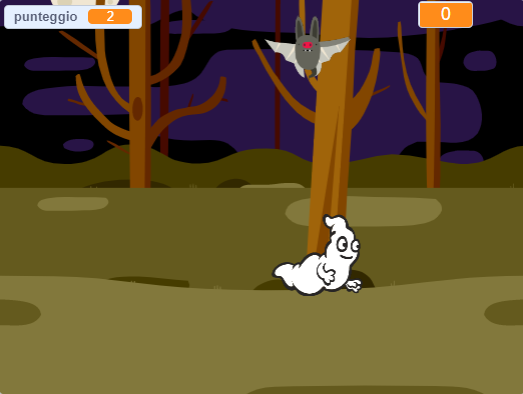

## Challenge

Improve your project with these challenges!

\--- task \---

Se il gioco è troppo facile, puoi:

+ Dare al giocatore meno tempo
+ Ridurre la frequenza con cui i fantasmi appaiono
+ Rimpicciolire i fantasmi

\--- /task \---

\--- task \---

Puoi aggiungere altri sprite al tuo gioco?

\--- collapse \---

* * *

title: Extra Sprites

* * *

Devi pensare ad alcune cose per ogni sprite che vuoi aggiungere:

+ Quanto dovrebbe essere grande?
+ Dovrebbe apparire più o meno spesso dell'immagine del fantasma?
+ Che aspetto/suono avrà quando verrà catturato?
+ Quanti punti vince il giocatore (o perde) per averlo catturato?

Se hai bisogno di aiuto, puoi tornare alle istruzioni dei passaggi precedenti o chiedere ad un amico!

\--- /collapse \---

\--- /task \---

\--- task \---

Can you add code to your ghost sprite to make the ghost `wait`{:class="block3control"} a random amount of time while it is hidden?

\--- /task \---

\--- task \---

Can you use the `set size`{:class="block3looks"} block to make your ghost a randomly larger or smaller each time it appears?

\--- /task \---

\--- task \---

Can you add code to your ghost so that the ghost makes a sound when it's caught?

\--- /task \---