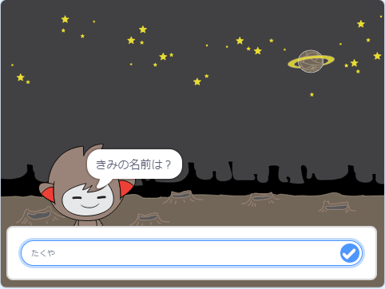

## 次は何をしましょうか？

ゴーストバスターのプロジェクトの完成 (かんせい) おめでとうございます！ もう少しむずかしいものをやってみませんか？

[「チャットボット」](https://projects.raspberrypi.org/ja-JP/projects/chatbot?utm_source=pathway&utm_medium=whatnext&utm_campaign=projects)プロジェクトをやってみましょう。

--- no-print ---

緑の旗をクリックし、チャットボットのキャラクターをクリックして会話を始めましょう。 チャットボットが質問 (しつもん) をしたら、ステージの下部にあるボックスに答えを入力します。右にある青いマークをクリックすると（または `Enter` をおすと) チャットボットが返事をします。

  <iframe allowtransparency="true" width="485" height="402" src="https://scratch.mit.edu/projects/embed/394143555/?autostart=false" 
  frameborder="0" scrolling="no"></iframe>

--- /no-print ---

--- print-only ---

--- /print-only ---

***
このプロジェクトは以下のボランティアによって翻訳されました。

松原慧子

森 友里恵

慶士 三瀧

Alan Peaty

Ueno Yuri

ボランティアのおかげで、世界中の人々に母国語で学ぶ機会を与えることができます。翻訳を引き受けていただくことで、より多くの人々に手を差し伸べることができます。詳しくは [rpf.io/translate](https://rpf.io/translate) をご覧ください。