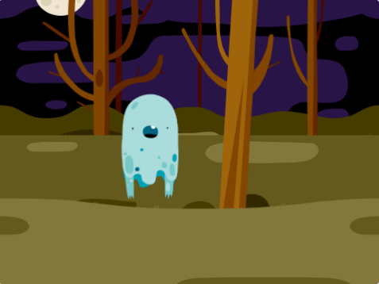

## おばけを動かす

\--- task \---

新しいスクラッチのプロジェクトを開きましょう。

[[[generic-scratch3-new-project]]]

\--- /task \---

\--- task \---

新しくおばけのスプライトと、ふさわしい背景（はいけい）を追加します。



[[[generic-scratch3-sprite-from-library]]]

[[[generic-scratch3-backdrop-from-library]]]

\--- /task \---

\--- task \---

緑の旗 (はた) がクリックされたときに、ずっとおばけが出てきたりきえたりするようにスプライトにコードを入れましょう。

\--- hints \--- \--- hint \---

`緑の旗が押(お)された`{:class="block3events"}とき、おばけを`1秒間`{:class="block3control"}`隠(かく)し`{:class="block3looks"}、そして`1秒間`{:class="block3control"}`表示 (ひょうじ) する`{:class="block3looks"}必要があります。 これが`ずっと`{:class=”block3control”}行われる必要があります。

\--- /hint \--- \--- hint \---

必要なコードブロックは次のとおりです。


```blocks3
hide

show

forever
end

wait (1) seconds

wait (1) seconds

when flag clicked
```

\--- /hint \--- \--- hint \---

コードは次のようになります。


```blocks3
when flag clicked
forever
hide
wait (1) seconds
show
wait (1) seconds
end
```

\--- /hint \--- \--- /hints \---

\--- /task \---

\--- task \---

プロジェクトをテストして保存 (ほぞん) しましょう。

[[[generic-scratch3-saving]]]

\--- /task \---