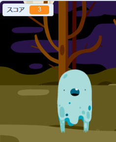

## スコアを追加する

スコアをつけてもっと面白くしましょう！

\--- task \---

「スコア」という新しい変数（へんすう）を作成します。

[[[generic-scratch-add-variable]]]

\--- /task \---

\--- task \---

プレイヤーのスコアをつけることができますか？おばけをクリックしてつかまえると、得点できます。

プレイヤーがおばけをクリックすると、スコアがふえます。

\--- hints \--- \--- hint \--- `グリーンフラッグがクリックされたとき`{:class=”blockevents”}、` スコア` {:class=”blockdata”}が`ゼロに変更される`{:class=”blockdata”}必要があります。 ステージはこのコードを追加するのに一番いい場所です。 `When the ghost sprite is clicked`{:class=”blockevents”}, the `score`{:class=”blockdata”} should be `changed by 1`{:class=”blockdata”}. \--- /hint \--- \--- hint \--- Here are the code blocks you will need to use:  \--- /hint \--- \--- hint \--- Here's how to score points by clicking ghosts:  \--- /hint \--- \--- /hints \---

\--- /task \---