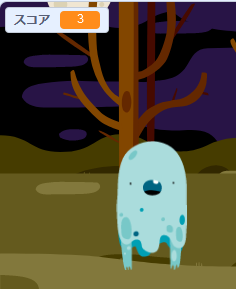

## スコアを追加する

スコアをつけてゲームをもっと面白くしましょう！

--- task ---

`スコア`{:class="block3variables"}という名前の新しい変数 (へんすう) を作りましょう。

[[[generic-scratch3-add-variable]]]

--- /task ---

--- task ---

プレイヤーのスコアをつけることができますか？おばけをクリックしてつかまえると、とくてんできます。

プレイヤーがおばけをクリックすると、スコアがふえます。



--- hints ---
 --- hint ---

`緑の旗が押されたとき`{:class="block3events"}、`スコア`{:class="block3variables"}変数が`0になる`{:class="block3variables"}必要があります。 ステージはこのコードを追加するのに一番いい場所です。

`おばけのスプライトが押されたとき`{:class="block3events"}、`スコア`{:class="block3variables"}変数が`1ずつ変わる`{:class="block3variables"}必要があります。

--- /hint --- --- hint ---

必要なコードブロックは次のとおりです。


```blocks3
set [スコア v] to (0)

when flag clicked
```


```blocks3
change [スコア v] by (1)
```

--- /hint --- --- hint ---


```blocks3
when flag clicked
set [スコア v] to (0)
```


```blocks3
When this sprite clicked
hide
+ change [スコア v] by (1)
```

--- /hint ------ /hints ---

--- /task ---