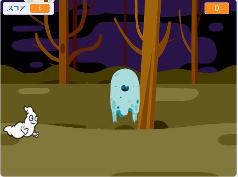

## チャレンジ：オブジェクトをふやす

ゲームに他のオブジェクトを追加できますか？

オブジェクトを追加するときは、次のことについて考えましょう。

+ 大きさはどの位ですか？
+ おばけよりも、よくあらわれますか？
+ つかまった時に、どのような見た目になりますか？音はどうなりますか？
+ プレイヤーがつかまえた時に、何点とれますか？または何点なくしますか？

別のオブジェクトを追加するには、上のやり方を使ってみましょう。