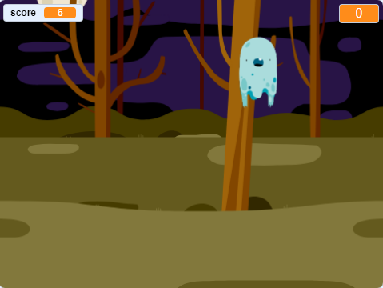

## ಪರಿಚಯ

You are going to make a ghost-catching game!

\--- no-print \---

  <iframe allowtransparency="true" width="485" height="402" src="https://scratch.mit.edu/projects/embed/276874679/?autostart=false" frameborder="0" scrolling="no"></iframe>
  

\--- /no-print \---

\--- print-only \---

\--- /print-only \---

## \--- collapse \---

## title: ನಿಮಗೆ ಬೇಕಾದುದು

### ಯಂತ್ರಾಂಶ(Hardware)

- ಒಂದು ಕಂಪ್ಯೂಟರ್

### ತಂತ್ರಾಂಶ(Software)

- Scratch 3 ([online](https://rpf.io/scratchon){:target="_blank"} ಅಥವಾ [offline](https://rpf.io/scratchoff){:target="_blank"})

\--- /collapse \---

## \--- collapse \---

## title: ನೀವು ಏನು ಕಲಿಯುವಿರಿ

- ಲೂಪ್(loop) ಗಳಲ್ಲಿನ ಕ್ರಿಯೆಗಳ ನಡುವೆ ವಿರಾಮಗಳ ಅಗತ್ಯವನ್ನು ಅರ್ಥಮಾಡಿಕೊಳ್ಳಿ
- Scratch ‌ನಲ್ಲಿ random ಸಂಖ್ಯೆಗಳನ್ನು ರಚಿಸಲು ಕೋಡ್ ಬಳಸಿ
- Scratch ‌ನಲ್ಲಿ ಆಟದ ಅಂಕ ಸಂಗ್ರಹಿಸಲು ವೇರಿಯೇಬಲ್(variable) ಸೇರಿಸಿ

\--- /collapse \---

## \--- collapse \---

## title: ಶಿಕ್ಷಣತಜ್ಞರಿಗೆ ಹೆಚ್ಚುವರಿ ಟಿಪ್ಪಣಿಗಳು

\--- no-print \---

If you need to print this project, please use the [printer-friendly version](https://projects.raspberrypi.org/en/projects/ghostbusters/print){:target="_blank"}.

\--- /no-print \---

You can find the [completed project here](https://rpf.io/p/en/ghostbusters-get){:target="_blank"}.

\--- /collapse \---