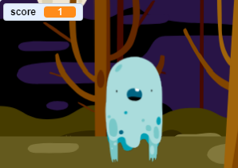

## ಅಂಕ ಸೇರಿಸಿ

ಈಗ ನೀವು ಅಂಕ ಇಟ್ಟುಕೊಂಡು ನಿಮ್ಮ ಆಟವನ್ನು ಹೆಚ್ಚು ಆಸಕ್ತಿಕರಗೊಳಿಸಲಿದ್ದೀರಿ!

--- task ---

`score`{:class="block3variables"} ಎಂಬ ಹೊಸ ವೇರಿಯಬಲ್ ಅನ್ನು ರಚಿಸಿ.

[[[generic-scratch3-add-variable]]]

--- /task ---

--- task ---

ಆಟಗಾರನ ಅಂಕವನ್ನು ನೀವು ಗಮನಿಸಬಹುದೇ? ಆಟಗಾರರು ಭೂತಗಳನ್ನು ಹಿಡಿಯಲು ಅವುಗಳ ಮೇಲೆ ಕ್ಲಿಕ್ ಮಾಡಿದಾಗ ಅಂಕಗಳನ್ನು ಗಳಿಸಬೇಕು.

ಪ್ರತಿ ಬಾರಿ ಆಟಗಾರನು ಭೂತದ ಮೇಲೆ ಕ್ಲಿಕ್ ಮಾಡಿದಾಗ, ಅವರ ಅಂಕ ಹೆಚ್ಚಾಗಬೇಕು.



--- hints ---
 --- hint ---

`When the green flag is clicked`{:class="block3events"}, your `score`{:class="block3variables"} variable should be `set to 0`{:class="block3variables"}. ಕೋಡ್ ಅನ್ನು ಸೇರಿಸಲು ಸ್ಟೇಜ್ ಉತ್ತಮ ಸ್ಥಳ.

`When the ghost sprite is clicked`{:class="block3events"}, the `score`{:class="block3variables"} variable should be `changed by 1`{:class="block3variables"}.

--- /hint --- --- hint ---

ನಿಮಗೆ ಅಗತ್ಯವಿರುವ ಕೋಡ್ ಬ್ಲಾಕ್‌ಗಳು ಇಲ್ಲಿವೆ:


```blocks3
set [score v] to (0)

when flag clicked
```


```blocks3
change [score v] by (1)
```

--- /hint --- --- hint ---


```blocks3
when flag clicked
set [score v] to (0)
```


```blocks3
When this sprite clicked
hide

+ change [score v] by (1)
```

--- /hint ------ /hints ---

--- /task ---