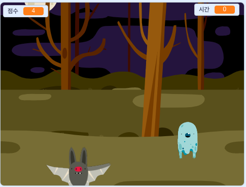

\--- no-print \---

This is the **Scratch 3** version of the project. There is also a [Scratch 2 version of the project](https://projects.raspberrypi.org/en/projects/ghostbusters-scratch2).

\--- /no-print \---

## 소개

이제부터 유령 잡기 게임을 만들어 봅시다!

\--- no-print \---

  <iframe allowtransparency="true" width="485" height="402" src="https://scratch.mit.edu/projects/embed/276874679/?autostart=false" frameborder="0" scrolling="no"></iframe>
  

\--- /no-print \---

\--- print-only \---

\--- /print-only \---

\--- collapse \---

* * *

## title: 준비물

### 하드웨어

- 컴퓨터

### 소프트웨어

- Scratch 3 (either [online](http://rpf.io/scratchon){:target="_blank"} or [offline](http://rpf.io/scratchoff){:target="_blank"})

\--- /collapse \---

\--- collapse \---

* * *

## title: 배우게 될 것

- Understand the need for pauses between actions within loops
- Use code to generate random numbers in Scratch
- Add a variable to store a game score in Scratch

\--- /collapse \---

## \--- 중간생략 \---

## title: Additional notes for educators

\--- no-print \---

If you need to print this project, please use the [printer-friendly version](https://projects.raspberrypi.org/en/projects/ghostbusters/print){:target="_blank"}.

\--- /no-print \---

Find the [solution to this project here](http://rpf.io/p/en/ghostbusters-get).

\--- / collapse \---