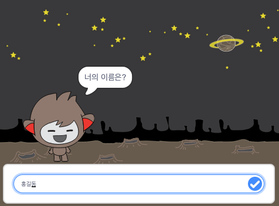

## 더 나아가기

유령잡기 프로젝트를 완료한 것을 축하합니다. 조금 더 도전적인 것을 만들고 싶습니까?

[챗봇](https://projects.raspberrypi.org/ko-KR/projects/chatbot?utm_source=pathway&utm_medium=whatnext&utm_campaign=projects)프로젝트를 진행해 해보세요

--- no-print ---

초록 깃발을 누른 후에, 챗봇을 눌러서 대화를 시작하십시오. 위의 화면에서 챗봇이 질문을 하면 하단에 위치한 텍스트 상자에 대답을 입력하고 상자 우측에 위치한 체크표시를 클릭하세요. (또는 `Enter`를 누르세요) 챗봇이 뭐라고 답하나 확인해 보세요.

  <iframe allowtransparency="true" width="485" height="402" src="https://scratch.mit.edu/projects/embed/248864190/?autostart=false" 
  frameborder="0" scrolling="no"></iframe>

--- /no-print ---

--- print-only ---

--- /print-only ---