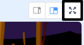

## Code for catching ghosts

Make your ghost disappear when it's been caught! The player should be able to click ghosts to catch them.

\--- task \---


```blocks3
이 스프라이트를 클릭했을 때
숨기기
```

\--- /task \---

**Tip:** If you test your game and find catching ghosts difficult, you can play the game in full-screen mode by clicking on this button:

