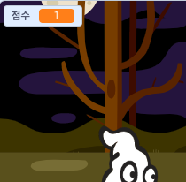

## Add a score

이제 점수 기능을 추가하여 게임을 더욱 재미있게 만들 것입니다!

\--- task \---

먼저, `score`{:class="block3variables"}라는 이름의 새 변수를 추가 해 보세요.

[[[generic-scratch3-add-variable]]]

\--- /task \---

Keep track of the player's score. Each time a player clicks on a ghost, their score should increase.



\--- task \---

Add this code to your ghost sprite:


```blocks3
When this sprite clicked
hide
+change [score v] by (1)
```

\--- /task \---

\--- task \---

Test your code. When you click the ghost, it should disappear and the score should change by 1.

\--- /task \---

\--- task \---

Add code to your ghost so that the score resets when a new game starts:


```blocks3
when flag clicked
+set [score v] to (0)
forever
hide
wait (1) seconds
go to (random position v)
show
wait (1) seconds
end
```

\--- /task \---