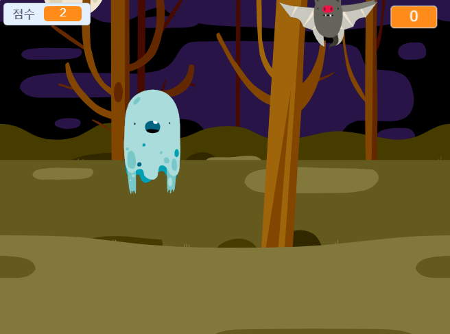

## Challenge

Improve your project with these challenges!

\--- task \---

If your game is too easy, you can:

+ 플레이 시간을 줄여 보세요.
+ 유령이 나타나는 회수를 줄여 보세요.
+ 유령의 크기를 줄여 보세요.

\--- /task \---

\--- task \---

게임에 다른 스프라이트를 추가할 수 있나요?

\--- collapse \---

* * *

title: Extra Sprites

* * *

스프라이트를 추가하려고 할 때 다음과 같은 사항을 고려해야 합니다.

+ 스프라이트는 얼마나 커야합니까?
+ 유령보다 더 자주 나와야 할까요? 덜 나와야 할까요?
+ 잡힐때 어떤 모양이어야 할까요? 어떤 소리를 낼까요?
+ 잡으면 몇 점을 얻거나 (혹은 잃게) 할까요?

도움이 필요하면 이전 단계의 지침으로 돌아가 다시 살펴보거나 친구에게 물어보십시오!

\--- /collapse \---

\--- /task \---

\--- task \---

Can you add code to your ghost sprite to make the ghost `wait`{:class="block3control"} a random amount of time while it is hidden?

\--- /task \---

\--- task \---

Can you use the `set size`{:class="block3looks"} block to make your ghost a randomly larger or smaller each time it appears?

\--- /task \---

\--- task \---

Can you add code to your ghost so that the ghost makes a sound when it's caught?

\--- /task \---