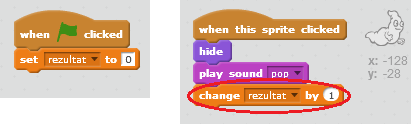

## Dodavanje rezultata

Napravimo igru zanimljivijom tako što ćemo pratiti rezultat!

\--- task \---

Kreiraj novu promjenljivu (variable) pod nazivom 'rezultat'.

[[[generic-scratch-add-variable]]]

\--- /task \---

\--- task \---

Da li možeš da pratiš igračev rezultat? Igrač bi trebalo da dobije bod kada klikne na duha i uhvati ga.

Svaki put kada igrač klikne na duha, njegov rezultat treba da se poveća.

\--- hints \--- \--- hint \--- `Kada se klikne na zelenu zastavicu` {:class=”blockevents”} (when the green flag is clicked), tvoja promjenljiva `rezultat`{:class=”blockdata”} treba da bude `postavljena na 0`{:class=”blockdata”} (set to 0). Pozornica (stage) je najbolje mjesto za dodavanje ovog kôda. `Kada se klikne na lik duha`{:class=”blockevents”} (when the ghost sprite is clicked), `rezultat`{:class=”blockdata”} treba da bude `promijenjen za 1`{:class=”blockdata”} (changed by 1). \--- /hint \--- \--- hint \--- Ovdje su blokovi kôda koje treba da koristiš:  \--- /hint \--- \--- hint \--- Ovako se dobijaju bodovi kada se klikne na duhove:  \--- /hint \--- \--- /hints \---

\--- /task \---