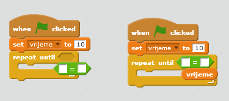

## Dodaj mjerač vremena

\--- task \---

Kreiraj novu promjenljivu pod nazivom 'vrijeme'.

\--- /task \---

\--- task \---

Možeš li da dodaš mjerač vremena na svoju Pozornicu kako bismo tvom igraču dali samo 10 sekundi da uhvati što više duhova?

Tvoj mjerač vremena treba da:

+ Počne sa 10 sekundi
+ Odbrojava svaku sekundu

Igra treba da se završi kada mjerač vremena dođe do 0.

\--- hints \--- \--- hint \--- `Kada se klikne na zelenu zastavicu`{:class=”blockevents”} (when the green flag is clicked), tvoja promjenljiva `vrijeme`{:class=”blockdata”} treba da bude `postavljena na 10`{:class=”blockdata”} (set to 10). Zatim treba svakog sekunda da se `promijeni za -1`{:class=”blockdata”} (change by -1) `dok ne dođe do 0`{:class=”blockcontrol"}. \--- /hint \--- \--- hint \--- Ovdje su blokovi kôda koje treba da koristiš:  \--- /hint \--- \--- hint \--- Ovako ćeš da dodaš mjerač vremena u svoju igru: 

A ovako ćeš da kreiraš blok `vrijeme = 0`:  \--- /hint \--- \--- /hints \---

\--- /task \---

\--- task \---

Zamoli prijatelje da isprobaju tvoju igru. Koliko bodova mogu da osvoje?

\--- /task \---

Ako je tvoja igra previše laka, možeš da uradiš sljedeće:

+ Daj igraču manje vremena
+ Make the ghosts appear less often
+ Make the ghosts smaller

\--- task \---

Change and test your game a few times until you're happy that it's the right level of difficulty.

\--- /task \---