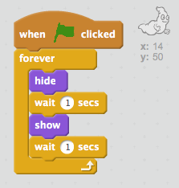

## एक भूत एनिमेटिंग

\--- कार्य \---

एक नवीन रिक्त स्क्रॅच प्रोजेक्ट उघडा.

[[[generic-scratch-new-project]]]

\--- / कार्य \---

\--- कार्य \---

नवीन भूत प्रेत आणि एक योग्य टप्पा पार्श्वभूमीमध्ये जोडा.

[[[generic-scratch-sprite-from-library]]]

[[[generic-scratch-backdrop-from-library]]]

\--- / कार्य \---

\--- कार्य \---

आपल्या भूतवर कोड जोडा जेणेकरून ती दिसते आणि आपण ध्वज क्लिक करता तेव्हा कायमचे अदृश्य होईल

\--- इशारे \--- \--- इशारा \--- एकदा `हिरवा झेंडा क्लिक केले आहे`, आपण आपल्या भूत करणे आवश्यक आहे `लपवा` साठी `एक सेकंद` आणि नंतर `शो` साठी `एक सेकंद`. या करावे लागेल `कायमचे`. \--- / इशारा \--- \--- इशारा \--- येथे आपल्याला आवश्यक कोड ब्लॉक आहेत:  \--- / हिच \--- \--- इशारा \--- हा आपला कोड असा असावा:  \--- / इशारा \--- \--- / इशारे \---

\--- / कार्य \---

\--- कार्य \---

आपल्या प्रकल्पाची चाचणी आणि जतन करा

[[[generic-scratch-saving]]]

\--- / कार्य \---