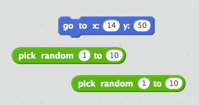

## अविशिष्ट भुते

आपले भूत क्षणभर पकडणे खूप सोपे आहे कारण ते हलवत नाही.

\--- कार्य \---

आपण आपल्या भूतलामध्ये कोड जोडू शकता जेणेकरुन त्याच स्थितीत राहण्याऐवजी ते स्क्रीनवर यादृच्छिक स्थितीत दिसून येईल?

\--- इशारे \--- \--- इशारा \--- आपण आपल्या भूत इच्छित `जा` प्रत्येक वेळी येण्यापूर्वी स्टेज वर एक यादृच्छिक स्थान. \--- / इशारा \--- \--- इशारा \--- आपण वापरु शकता अशा दोन कोड ब्लॉक आहेत. हा एक:  किंवा हा एक:  \--- / हिंत \--- \--- इशारा \--- तुमचा कोड याप्रमाणे असावा:  किंवा ते या प्रमाणे दिसेल:  \--- / संकेत \--- - - / इशारे \---

\--- / कार्य \---

\--- आव्हान \---

## आव्हान: अधिक यादृच्छिकता

आपण आपल्या भूत बनवू शकता `प्रतीक्षा` दिसणे आधी एक यादृच्छिक वेळ? आपण प्रत्येक वेळी असे दिसते की आपल्या भूतला एक यादृच्छिक आकार देण्यासाठी आपण `सेट आकार` ब्लॉक वापरू शकता? \--- / आव्हान \---