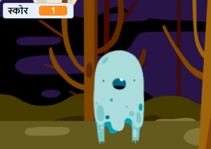

## एक अंक जोडा

आता आपण स्कोर राखून आपला गेम अधिक मनोरंजक बनविणार आहात!

\--- task \---

`score`{: class= "block3variables"}नावाचे एक नवीन व्हेरिएबल तयार करा.

[[[generic-scratch3-add-variable]]]

\--- /task \---

\--- task \---

आपण खेळाडूच्या स्कोअरचा मागोवा घेऊ शकता का? त्यांना पकडण्यासाठी भूतांवर क्लिक केल्यावर खेळाडूंनी गुण मिळविले पाहिजेत.

प्रत्येक वेळी जेव्हा खेळाडू भूतला क्लिक करतो तेव्हा त्यांचे गुण वाढू शकतात.



\--- hints \--- \--- hint \---

`जेव्हा हिरवा ध्वज क्लिक केला जाईल`{:class="block3events"}, तेव्हा आपला `score`{:class="block3variables"} व्हेरिएबल `0 वर सेट करावा `. हा कोड जोडण्यासाठी स्टेज हे सर्वोत्तम स्थान आहे.

`जेव्हा भूत स्प्राइट क्लिक केले जाते`{:class="block3events"}, तेव्हा `स्कोर `{:class="block3variables"} व्हेरिएबल `1 ने बदलला पाहिजे `{:class="block3variables"}.

\--- /hint \--- \--- hint \---

आपल्याला आवश्यक असलेले कोड ब्लॉक येथे आहेत:


```blocks3
set [score v] to (0)

when flag clicked
```


```blocks3
change [score v] by (1)
```

\--- /hint \--- \--- hint \---


```blocks3
when flag clicked
set [score v] to (0)
```


```blocks3
When this sprite clicked
hide

+ change [score v] by (1)
```

\--- /hint \--- \--- /hints \---

\--- /task \---