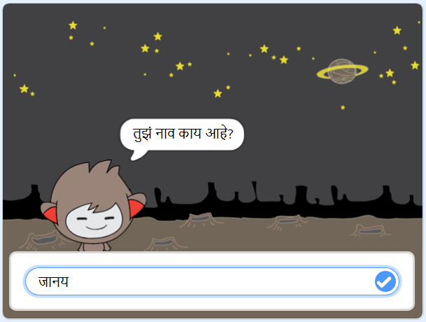

## What can you do now?

घोस्टबस्टर प्रकल्प पूर्ण केल्याबद्दल अभिनंद! आपण काहीतरी अधिक आव्हानात्मक तयार करू इच्छिता?

[चॅटबॉट](https://projects.raspberrypi.org/en/projects/chatbot?utm_source=pathway&utm_medium=whatnext&utm_campaign=projects) प्रकल्प करून पहा.

\--- no-print \---

संभाषण सुरू करण्यासाठी ग्रीन ध्वज क्लिक करा आणि नंतर चॅटबॉट वर्ण वर क्लिक करा. जेव्हा चॅटबॉट एक प्रश्न विचारतो, तेव्हा आपले उत्तर स्टेजच्या तळाशी असलेल्या बॉक्समध्ये टाइप करा आणि नंतर चॅटबॉटचे उत्तर पाहण्यासाठी उजवीकडे निळ्या चिन्हावर क्लिक करा (किंवा `Enter`दाबा).

  <iframe allowtransparency="true" width="485" height="402" src="https://scratch.mit.edu/projects/embed/248864190/?autostart=false" 
  frameborder="0" scrolling="no"></iframe>

\--- /no-print \---

\--- print-only \---

\--- /print-only \---

Try our [More Scratch](https://projects.raspberrypi.org/en/pathways/more-scratch) project pathway where you will move beyond the basics introduced in Introduction to Scratch. You will make awesome apps, games and simulations!