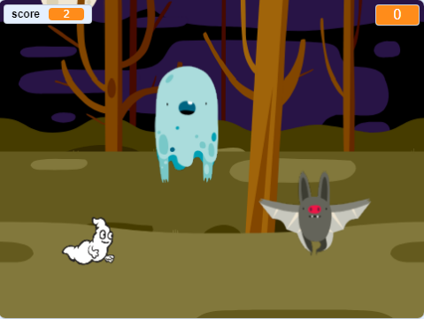

  [ऑफलाइन पूर्ण झालेले प्रोजेक्ट] (संसाधने / घोस्टबस्टर्स-फिनिश्ड एसबी 2) {: डाउनलोड = 'घोस्टबस्टर-फिनिशस एसबी 2'} [ऑनलाइन पूर्ण झालेले प्रकल्प] (http://scratch.mit.edu/projects/60787262/#editor) { : target = "_ blank"}

\--- आव्हान \---

## आव्हान: अधिक वस्तू

आपण आपल्या गेममध्ये इतर वस्तू जोडू शकता?

जेव्हा आपण एखादा ऑब्जेक्ट जोडत असतो, तेव्हा आपण खालील गोष्टींबद्दल विचार करण्याची गरज आहे.

+ तो किती मोठा आहे?
+ ते भूत पेक्षा अधिक किंवा कमी वेळा दिसून येईल?
+ ते पकडले गेल्यावर काय दिसेल / ध्वनी येईल?
+ खेळाडू पकडण्यासाठी किती गुण (किंवा गमावले जातील)?

आपल्याला इतर ऑब्जेक्ट जोडताना मदतीची आवश्यकता असल्यास, आपण वरील चरण पुन्हा वापरू शकता!

\--- / आव्हान \---