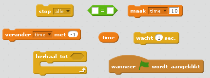
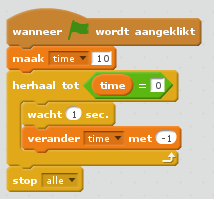
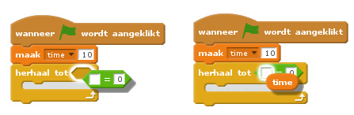

## Een timer toevoegen

--- task ---

Maak een nieuwe variabele met de naam 'time'.

--- /task ---

--- task ---

Kun je een timer toevoegen aan het speelveld zodat de speler maar 10 seconden de tijd heeft om zoveel mogelijk spoken te vangen?

Je timer zou:

+ Beginnen op 10 seconden
+ Elke seconde aftellen

Het spel zou moeten stoppen als de timer op 0 komt.

--- hints --- --- hint --- `Als op de groene vlag is geklikt`, zou de variabele `time` op `10` moeten staan. Door blok ` verander time met -1 ` wordt er afgeteld ` totdat 0 bereikt is `. --- /hint --- --- hint --- Hier zijn de codeblokken die je nodig hebt:  --- /hint --- --- hint --- Hier zie je hoe je de timer in je spel kunt voegen: 

En zo maak je het `time = 0` blok:  --- /hint --- --- /hints ---

--- /task ---

--- task ---

Vraag een vriend om je spel te testen. Hoeveel punten kan die scoren?

--- /task ---

Als je spel te gemakkelijk is, kun je:

+ De speler minder tijd geven
+ De spoken minder vaak laten verschijnen
+ De spoken kleiner maken

--- task ---

Verander en test je spel een paar keer totdat je tevreden bent met de moeilijkheidsgraad.

--- /task ---