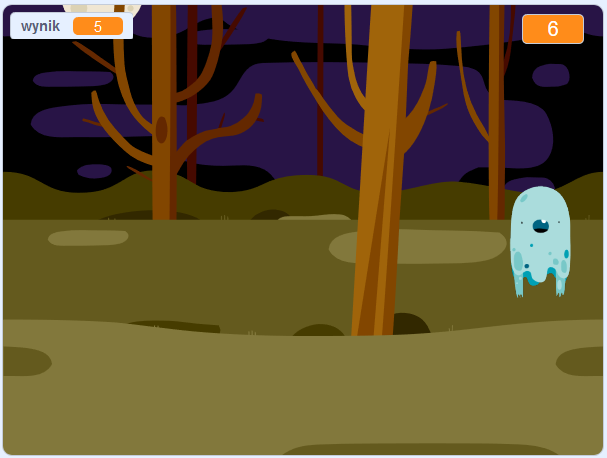

\--- no-print \---

Ta wersja projektu jest przeznaczona dla języka **Scratch 3**. Projekt dostępny jest również [w wersji dla języka Scratch 2](https://projects.raspberrypi.org/en/projects/ghostbusters-scratch2).

\--- /no-print \---

## Wprowadzenie

Zrobisz upiorną grę!

\--- no-print \---

  <iframe allowtransparency="true" width="485" height="402" src="https://scratch.mit.edu/projects/embed/276874679/?autostart=false" frameborder="0" scrolling="no"></iframe>
  

\--- /no-print \---

\--- print-only \---

\--- /print-only \---

## \--- collapse \---

## title: What you will need

### Sprzęt

- Komputer

### Oprogamowanie

- Scratch 3 ([online](http://rpf.io/scratchon){:target="_blank"} lub [offline](http://rpf.io/scratchoff){:target="_blank"})

\--- /collapse \---

## \--- collapse \---

## title: What you will learn

- Zrozumiesz działanie przerw pomiędzy czynnościami w pętli
- Wykorzystasz kod do generowania losowych liczb w Scratch
- Stworzysz zmienną, aby przechować wynik gry w Scratch

\--- /collapse \---

## \--- collapse \---

## title: Additional notes for educators

\--- no-print \---

If you need to print this project, please use the [printer-friendly version](https://projects.raspberrypi.org/en/projects/ghostbusters/print){:target="_blank"}.

\--- /no-print \---

You can find the [completed project here](http://rpf.io/p/en/ghostbusters-get){:target="_blank"}.

\--- /collapse \---