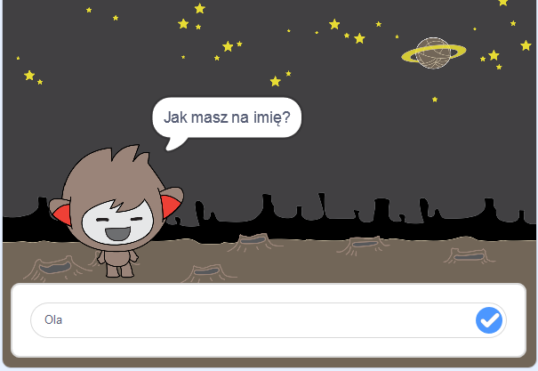

## Co następne?

Dobrze Ci poszło z ukończeniem projektu! Czy chcesz stworzyć coś trudniejszego?

Wypróbuj projekt [Chatbot](https://projects.raspberrypi.org/pl-PL/projects/chatbot?utm_source=pathway&utm_medium=whatnext&utm_campaign=projects).

--- no-print ---

Kliknij zieloną flagę, a następnie kliknij znak chatbota, aby rozpocząć rozmowę. Gdy chatbot zada pytanie, wpisz odpowiedź w polu u dołu sceny, a następnie kliknij na niebieski znaczek po prawej stronie (lub naciśnij klawisz `Enter`), aby zobaczyć odpowiedź chatbota.

  <iframe allowtransparency="true" width="485" height="402" src="https://scratch.mit.edu/projects/embed/334706729/?autostart=false" 
  frameborder="0" scrolling="no"></iframe>

--- /no-print ---

--- print-only ---

--- /print-only ---

**Tłumaczenie wykonane przez wolontariuszy**

Projekt ten przetłumaczył **Tomasz Przybyłek** a zweryfikował **Marek Lubinski**.

Dzięki naszym wspaniałym wolontariuszom, ludzie na całym świecie mogą nauczyć się kodowania. Tłumacząc nasze projekty możesz pomóc nam dotrzeć do większej liczby ludzi. Więcej informacji na stronie [rpf.io/translate](https://rpf.io/translate).