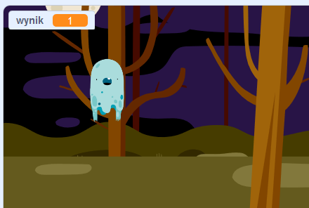

## Dodaj wynik

Teraz sprawisz, że twoja gra będzie bardziej interesująca dzięki zbieraniu punktów!

--- task ---

Utwórz nową zmienną o nazwie `wynik`{:class="block3variables"}.

[[[generic-scratch3-add-variable]]]

--- /task ---

--- task ---

Czy możesz śledzić wynik gracza? Gracze powinni zdobywać punkty, łapiąc duchy poprzez kliknięcie na nie.

Za każdym razem, gdy gracz kliknie na ducha, jego wynik powinien wzrosnąć.



--- hints ---
 --- hint ---

`Po kliknięciu zielonej flagi`{:class="block3events"} twoja zmienna `wynik`{:class="block3variables"} powinna być `ustawiona na 0`{:class="block3variables"}. Scena jest najlepszym miejscem do dodania tego kodu.

`Po kliknięciu duszka ducha`{:class="block3events"}, zmienna `wynik`{:class="block3variables"} powinna być `zmieniona o 1`{:class="block3variables"}.

--- /hint --- --- hint --- Oto potrzebne bloki kodu: 

```blocks3
ustaw [wynik v] na (0)

po kliknięciu flagi
```


```blocks3
zmienić [wynik v] o (1)
```

--- /hint --- --- hint ---

```blocks3
kiedy kliknięto zieloną flagę
ustaw [wynik v] na (0)
```


```blocks3
Kiedy duszek kliknięty
ukryj

+ zmień [wynik v] o (1)
```

--- /hint --- --- /hints ---

--- /task ---