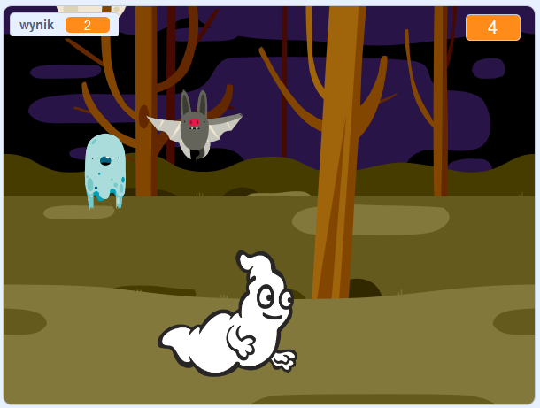

## Wyzwanie: więcej duszków

Czy możesz dodać inne duszki do swojej gry?

Musisz pomyśleć o kilku rzeczach dla każdego duszka, które chcesz dodać:

+ Jak duży powinien być duszek?
+ Czy powinien pojawiać się częściej czy rzadziej niż duszek ducha?
+ Jak wygląda / brzmi, kiedy zostanie złapany?
+ Ile punktów zdobywa (lub traci) gracz za złapanie duszka?

Jeśli potrzebujesz pomocy, możesz wrócić do instrukcji z poprzednich kroków lub poprosić znajomego!