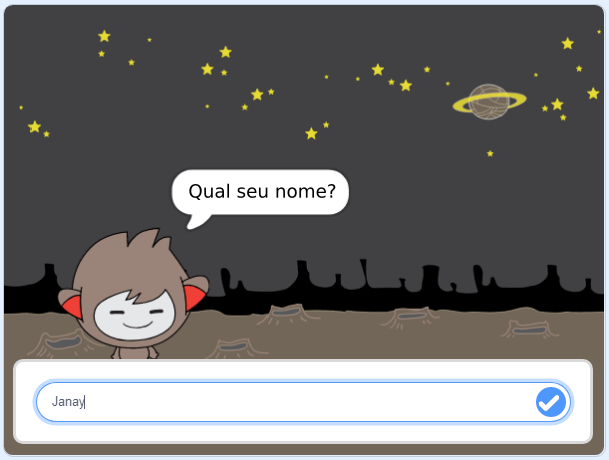

## E agora?

Parabéns por completar o projeto Caça-Fantasmas! Gostaria de criar algo um pouco mais desafiador?

Experimente o projeto [Chatbot](https://projects.raspberrypi.org/en/projects/chatbot?utm_source=pathway&utm_medium=whatnext&utm_campaign=projects).

\--- no-print \---

Clique na bandeira verde e clique no personagem do chatbot para iniciar uma conversa. Quando o robô fizer uma pergunta, digite a sua resposta na caixa na parte inferior do Palco e clique na marca azul à direita (ou pressione ` Enter `), para ver a resposta do robô falante.

  <iframe allowtransparency="true" width="485" height="402" src="https://scratch.mit.edu/projects/embed/248864190/?autostart=false" 
  frameborder="0" scrolling="no"></iframe>

\--- /no-print \---

\--- print-only \---

\--- /print-only \---