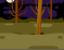

## Add a timer

Add a timer to your Stage to give your player only 10 seconds to catch ghosts.

Seu cronômetro deve:

+ Começar mostrando 10 segundos
+ Contagem regressiva a cada segundo

O jogo deve parar quando o cronômetro chegar a 0.

\--- task \---

Create a new variable called `time`{:class="block3variables"}.

\--- /task \---

\--- task \---

Add this code to your **Stage**:



```blocks3
quando bandeira verde for clicada
mude [tempo v] para [10]
repita até que < (tempo) = [0] >
espere (1) segundo
adicione (-1) a [tempo v]
fim
pare [todos]
```

\--- /task \---

\--- task \---

Ask a friend to test your game. How many points can they score?

\--- /task \---

\--- task \---

Change and test your game a few times until you're happy with its level of difficulty.

\--- /task \---