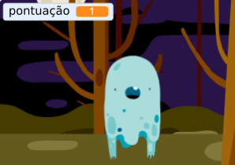

## Adicionando uma pontuação

Agora você vai tornar seu jogo mais interessante marcando a pontuação!

\--- task \---

Crie uma nova variável chamada de `pontuação`{:class="block3variables"}.

[[[generic-scratch3-add-variable]]]

\--- /task \---

\--- task \---

Você consegue acompanhar a pontuação do jogador? Os jogadores marcam pontos ao clicar nos fantasmas para capturá-los.

Cada vez que um jogador clicar em um fantasma, sua pontuação deve aumentar.



\--- hints \--- \--- hint \---

`Quando bandeira verde for clicada`{:class="block3events"}, sua variável da `pontuação`{:class="block3variables"} deve `mudar para 0`{:class="block3variables"}. O Palco é o melhor lugar para adicionar esse código.

`Quando o fantasma for clicado`{:class="block3events"}, a variável da `pontuação`{:class="block3variables"} `deverá ser somada em 1`{:class="block3variables"}.

\--- /hint \--- \--- hint \---

Here are the code blocks you need:


```blocks3
mude [pontuação v] para (0)

quando a bandeira verde for clicada
```


```blocks3
adicione (1) a [pontuação v]
```

\--- /hint \--- \--- hint \---


```blocks3
quando a bandeira verde for clicada
mude [pontuação v] para (0)
```


```blocks3
Quando este fantasma for clicado
esconda

+ adicione (1) a [pontuação v]
```

\--- /hint \--- \--- /hints \---

\--- /task \---