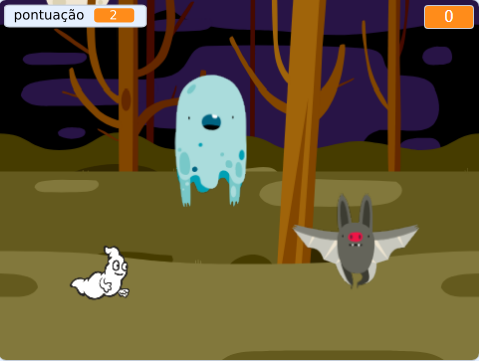

## Challenge

Improve your project with these challenges!

\--- task \---

If your game is too easy, you can:

+ Dar ao jogador menos tempo
+ Fazer os fantasmas aparecerem com menos frequência
+ Diminuir o tamanho dos fantasmas

\--- /task \---

\--- task \---

Você consegue adicionar outros fantasmas no seu jogo?

\--- collapse \---

* * *

title: Extra Sprites

* * *

Você precisa pensar em algumas coisas para cada um dos fantasmas que você deseja adicionar:

+ Qual o tamanho do fantasma?
+ Ele deve aparecer com mais ou menos frequência que o ator fantasma?
+ Qual vai ser a aparência ou som quando ele é capturado?
+ Quantos pontos o jogador ganha (ou perde) por capturar o fantasma?

Se precisar de ajuda, você pode voltar às instruções dos passos anteriores, ou perguntar a um amigo!

\--- /collapse \---

\--- /task \---

\--- task \---

Can you add code to your ghost sprite to make the ghost `wait`{:class="block3control"} a random amount of time while it is hidden?

\--- /task \---

\--- task \---

Can you use the `set size`{:class="block3looks"} block to make your ghost a randomly larger or smaller each time it appears?

\--- /task \---

\--- task \---

Can you add code to your ghost so that the ghost makes a sound when it's caught?

\--- /task \---