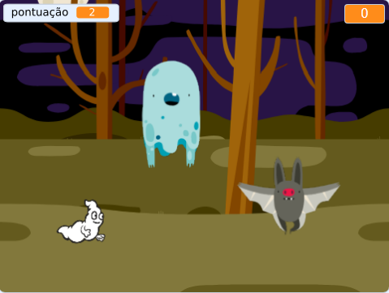

## Desafio: mais fantasmas

Você consegue adicionar outros fantasmas no seu jogo?

Você precisa pensar em algumas coisas para cada um dos fantasmas que você deseja adicionar:

+ Qual o tamanho do fantasma?
+ Ele deve aparecer com mais ou menos frequência que o ator fantasma?
+ Qual vai ser a aparência ou som quando ele é capturado?
+ Quantos pontos o jogador ganha (ou perde) por capturar o fantasma?

Se precisar de ajuda, você pode voltar às instruções dos passos anteriores, ou perguntar a um amigo!