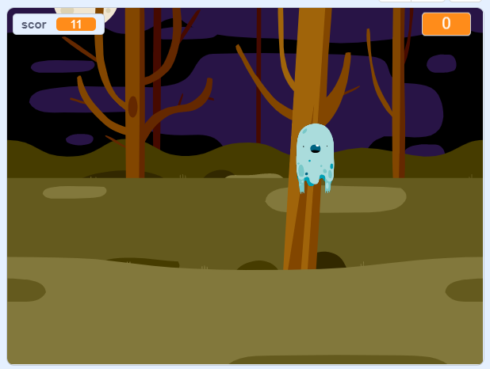

\--- no-print \---

Aceasta este versiunea **Scratch 3** a proiectului. Există, de asemenea, o [versiune Scratch 2 a proiectului](https://projects.raspberrypi.org/en/projects/ghostbusters-scratch2).

\--- /no-print \---

## Introducere

Ești pe cale să faci un joc de vânat fantome!

\--- no-print \---

  <iframe allowtransparency="true" width="485" height="402" src="https://scratch.mit.edu/projects/embed/276874679/?autostart=false" frameborder="0" scrolling="no"></iframe>
  

\--- /no-print \---

\--- print-only \---

\--- /print-only \---

## \--- collapse \---

## title: What you will need

### Hardware

- Un computer

### Software

- Scratch 3 (fie [online](http://rpf.io/scratchon){:target="_blank"} sau [offline](http://rpf.io/scratchoff){:target="_blank"})

\--- /collapse \---

## \--- collapse \---

## title: What you will learn

- Vei înțelege nevoia pauzelor între acțiunile din bucle
- Vei folosi cod pentru a genera numere aleatorii în Scratch
- Vei adăuga o variabilă pentru a stoca scorul unui joc în Scratch

\--- /collapse \---

## \--- collapse \---

## title: Additional notes for educators

\--- no-print \---

If you need to print this project, please use the [printer-friendly version](https://projects.raspberrypi.org/en/projects/ghostbusters/print){:target="_blank"}.

\--- /no-print \---

You can find the [completed project here](http://rpf.io/p/en/ghostbusters-get){:target="_blank"}.

\--- /collapse \---