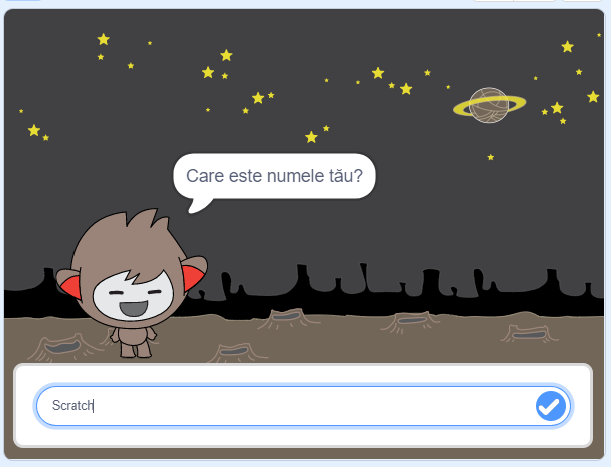

## Ce urmează?

Felicitări pentru finalizarea proiectului „Vânătorii de fantome”! Vrei să creezi ceva mai complicat?

Încearcă proiectul nostru [Chatbot](https://projects.raspberrypi.org/ro-RO/projects/chatbot?utm_source=pathway&utm_medium=whatnext&utm_campaign=projects).

--- no-print ---

Dă click pe steagul verde, iar apoi dă click pe chatbot pentru a începe o conversație. Atunci când chatbot-ul pune o întrebare, scrie răspunsul în caseta din partea de jos a Scenei, iar apoi dă click pe bifa albastră din dreapta (sau apasă `Enter`) pentru a vedea răspunsul chatbot-ului.

  <iframe allowtransparency="true" width="485" height="402" src="https://scratch.mit.edu/projects/embed/248864190/?autostart=false" 
  frameborder="0" scrolling="no"></iframe>

--- /no-print ---

--- print-only ---

--- /print-only ---

***

Acest proiect a fost tradus de voluntarii:

Nicolae Vranciu

Gelu Ungur

Catalina Toderita

Datorită voluntarilor, putem oferi oamenilor din întreaga lume șansa de a învăța în propria lor limbă. Ne poți ajuta să ajungem la mai multe persoane, ajutând la traducere ca și voluntar - mai multe informații la [rpf.io/translate](https://rpf.io/translate).