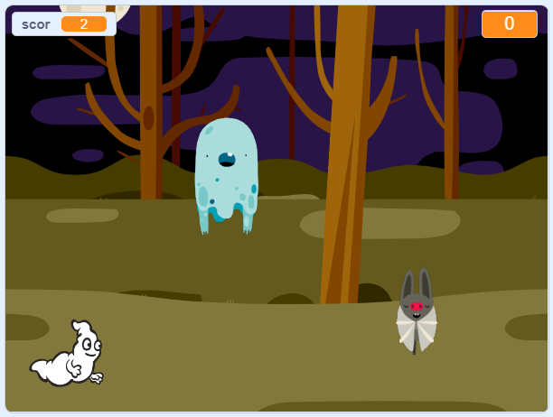

## Challenge

Improve your project with these challenges!

\--- task \---

If your game is too easy, you can:

+ Micșora timpul de joc
+ Aranja ca fantomele să apară mai rar
+ Micșora fantomele

\--- /task \---

\--- task \---

Poți să adaugi alte personaje la jocul tău?

\--- collapse \---

* * *

title: Extra Sprites

* * *

Trebuie să te gândești la câteva lucruri pentru fiecare personaj pe care vrei să-l adaugi:

+ Cât de mare ar trebui să fie personajul?
+ Ar trebui să apară mai des sau mai rar decât fantomele?
+ Cum arată/sună atunci când este prins?
+ Câte puncte va primi (sau pierde) jucătorul pentru prinderea personajului?

Dacă ai nevoie de ajutor, poți merge înapoi la instrucțiunile de la pașii anteriori, sau poți întreba un prieten!

\--- /collapse \---

\--- /task \---

\--- task \---

Can you add code to your ghost sprite to make the ghost `wait`{:class="block3control"} a random amount of time while it is hidden?

\--- /task \---

\--- task \---

Can you use the `set size`{:class="block3looks"} block to make your ghost a randomly larger or smaller each time it appears?

\--- /task \---

\--- task \---

Can you add code to your ghost so that the ghost makes a sound when it's caught?

\--- /task \---