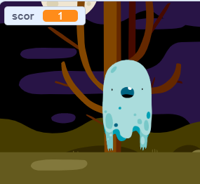

## Adaugă un scor

Acum, vei face jocul tău mai interesant ținând scorul!

--- task ---

Creează o nouă variabilă numită `scor`{:class="block3variables"}.

[[[generic-scratch3-add-variable]]]

--- /task ---

--- task ---

Poți ține scorul unui jucător? Jucătorii ar trebui să primească puncte când aceștia dau click pe fantome pentru a le prinde.

De fiecare dată când un jucător dă click pe o fantomă, scorul lui ar trebui să crească.



--- hints ---
 --- hint ---

`Când se dă click pe stegulețul verde`{:class="block3events"}, variabila `scor`{:class="block3variables"} ar trebui să fie `setată la 0`{:class="block3variables"}. Scena este cel mai bun loc pentru acest cod.

`Când se dă click pe acest personaj`{:class="block3events"}, variabila `scor`{:class="block3variables"} ar trebui să fie `modificată cu 1`{:class="block3variables"}.

--- /hint --- --- hint --- Iată blocurile de cod de care ai nevoie: 

```blocks3
setează [scor v] la (0)

când se dă click pe stegulețul verde
```


```blocks3
modifică [scor v] cu (1)
```

--- /hint --- --- hint --- 

```blocks3
când se dă click pe stegulețul verde
setează [scor v] la (0)
```


```blocks3
Când se dă click pe acest personaj
ascunde

+ modifică [scor v] cu (1)
```

--- /hint --- --- /hints ---

--- /task ---