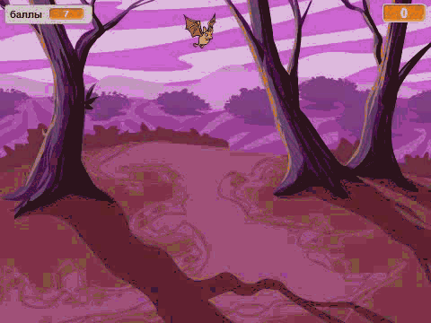

## Введение

Ты собираешься сделать игру о ловле призраков!

### Что тебе нужно сделать

\--- no-print \---

\--- /no-print \---

\--- print-only \---

\--- /print-only \---

\--- collapse \---

* * *

## title: Что тебе понадобится

### Оборудование

+ Компьютер

### Программное обеспечение

+ Scratch 2.0 (либо [онлайн-редактор](http://rpf.io/scratchon){:target="_blank"}, либо [автономный редактор (без подключения к Интернету)](http://rpf.io/scratchoff){:target="_blank"})

\--- /collapse \---

\--- collapse \---

* * *

## title: Чему ты научишься

Этот проект включает в себя элементы из [Raspberry Pi Digital Making Curriculum](http://rpf.io/curriculum){:target="_blank"}:

+ [Используй базовые конструкции программирования для создания простых программ.](https://www.raspberrypi.org/curriculum/programming/creator)

\--- /collapse \---

\--- no-print \---

Если ты хочешь распечатать этот проект, то воспользуйся [версией для печати](https://projects.raspberrypi.org/en/projects/ghostbusters/print).

\--- /no-print \---