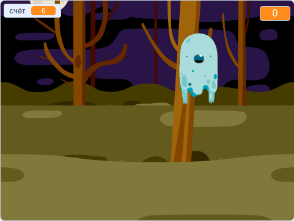

\--- no-print \---

Это версия проекта **Scratch 3**. Существует также версия проекта [Scratch 2](https://projects.raspberrypi.org/en/projects/ghostbusters-scratch2).

\--- /no-print \---

## Введение

Ты сделаешь игру о ловле приведений!

\--- no-print \---

  <iframe allowtransparency="true" width="485" height="402" src="https://scratch.mit.edu/projects/embed/276874679/?autostart=false" frameborder="0" scrolling="no"></iframe>
  

\--- /no-print \---

\--- print-only \---

\--- /print-only \---

## \--- collapse \---

## title: Что тебе понадобится

### Оборудование

- Компьютер

### Программное обеспечение

- Scratch 3 (либо [онлайн-редактор](http://rpf.io/scratchon){:target="_blank"}, либо [оффлайн редактор (без подключения к Интернету)](http://rpf.io/scratchoff){:target="_blank"})

\--- /collapse \---

## \--- collapse \---

## title: Чему ты научишься

- Понимать, зачем нужны паузы между действиями внутри циклов
- Использовать код для генерации случайных чисел в Scratch
- Добавлять переменную для сохранения результата игры в Scratch

\--- /collapse \---

## \--- collapse \---

## title: Дополнительные примечания для педагогов

\--- no-print \---

Если вам нужно распечатать этот проект, используйте [версию для печати](https://projects.raspberrypi.org/en/projects/ghostbusters/print){:target="_blank"}.

\--- /no-print \---

Вы можете найти [завершённый проект здесь](http://rpf.io/p/en/ghostbusters-get){:target="_blank"}.

\--- /collapse \---