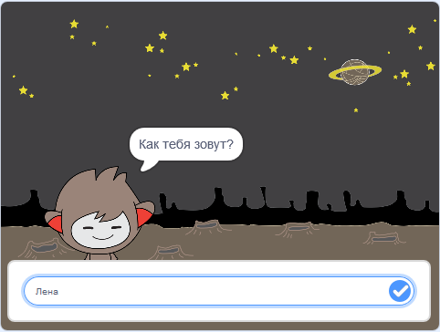

## Что дальше?

Ты отлично закончил проект Охотники за привидениями! Ты хочешь создать что-то более сложное?

Попробуй проект [Чат-бот](https://projects.raspberrypi.org/en/projects/chatbot?utm_source=pathway&utm_medium=whatnext&utm_campaign=projects).

\--- no-print \---

Нажми на зелёный флаг, а затем нажми на персонажа чат-бота, чтобы начать разговор. Когда чат-бот задаёт вопрос, введи свой ответ в поле в нижней части Сцены, а затем нажми на синюю метку справа (или нажми `Enter`), чтобы увидеть ответ чат-бота.

  <iframe allowtransparency="true" width="485" height="402" src="https://scratch.mit.edu/projects/embed/248864190/?autostart=false" 
  frameborder="0" scrolling="no"></iframe>

\--- /no-print \---

\--- print-only \---

\--- /print-only \---