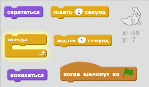
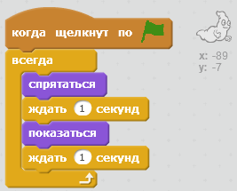

## Анимация призрака

\--- task \---

Открой новый пустой проект Scratch.

[[[generic-scratch-new-project]]]

\--- /task \---

\--- task \---

Добавь новый спрайт призрака и подходящий фон для сцены.

[[[generic-scratch-sprite-from-library]]]

[[[generic-scratch-backdrop-from-library]]]

\--- /task \---

\--- task \---

Добавь код для своего призрака, чтобы он появлялся и исчезал, когда ты щёлкаешь на флаге.

\--- hints \--- \--- hint \--- После щелчка на `зелёном флаге`{:class=”blockevents”}, тебе нужно `скрыть (hide)`{:class=”blocklooks”} твоего призрака на `одну секунду`{:class=”blockcontrol”}, а затем `показать его (show)`{:class=”blocklooks”} на `одну секунду`{:class=”blockcontrol”}. Нужно выполнять это `постоянно`{:class=”blockcontrol”}. \--- /hint \--- \--- hint \--- Тебе понадобятся такие блоки кода:  \--- /hint \--- \--- hint \--- Твой код должен будет выглядеть как-то так:  \--- /hint \--- \--- /hints \---

\--- /task \---

\--- task \---

Проверь и сохрани проект.

[[[generic-scratch-saving]]]

\--- /task \---