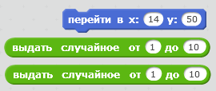
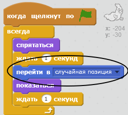

## Случайные призраки

Сейчас твоего призрака очень легко поймать, потому что он не двигается!

\--- task \---

Можешь ли ты добавить к своему призраку код, который позволил бы призраку появляться в случайных местах экрана, а не стоять на месте?

\--- hints \--- \--- hint \--- Ты хочешь, чтобы перед каждым появлением твой призрак `перемещался`{:class=”blockmotion”} в случайное место на сцене. \--- /hint \--- \--- hint \--- Для этого ты можешь использовать два набора блоков кода. Вот этот:  Или этот:  \--- /hint \--- \--- hint \--- Твой код должен выглядеть как-то так:  Или же он может выглядеть так:  \--- /hint \--- \--- /hints \---

\--- /task \---

\--- challenge \---

## Задача: больше случайностей

Можешь ли ты попросить своего призрака `ждать`{: class = "blockcontrol"} некоторое количество времени перед появлением? Можешь ли ты использовать блок `указания размера` {: class = "blocklooks"}, чтобы твой призрак при каждом появлении имел случайный размер? \--- /challenge \---