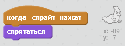

## Ловля призраков

Давай позволим игроку ловить призраков!

\--- task \---

Можешь ли ты заставить твоего призрака исчезнуть, когда его поймали?

Тебе нужно сделать так, чтобы при щелчке на призраке он был пойман. Если ты считаешь, что процесс ловли получился сложным, то ты можешь играть в игру в полноэкранном режиме, нажав эту кнопку:

\--- hints \--- \--- hint \--- `После щелчка`{:class=”blockevents”} спрайт твоего призрака должен `скрыться`{:class=”blocklooks”}. \--- /hint \--- \--- hint \--- Твой код должен выглядеть как-то так:  \--- /hint \--- \--- /hints \---

\--- /task \---

\--- challenge \---

## Задача: добавление звука

Можешь ли ты заставить своего призрака издавать звук каждый раз, когда его поймают? \--- /challenge \---