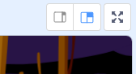

## Ловля призраков

Давай позволим игроку ловить призраков!

\--- task \---

Можешь ли ты заставить твоего призрака исчезнуть, когда его поймали?

You should be able to click ghosts to catch them. If you find the catching difficult, you can play the game in full-screen mode by clicking this button:

\--- hints \--- \--- hint \--- `When clicked`{:class=”blockevents”}, your ghost sprite should `hide`{:class=”blocklooks”}. \--- /hint \--- \--- hint \--- Your code should look like this:  \--- /hint \--- \--- /hints \---

\--- /task \---

\--- challenge \---

## Challenge: adding a sound

Can you get your ghost to make a sound each time it's caught? \--- /challenge \---