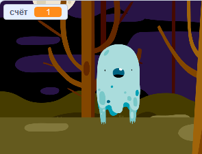

## Добавление баллов

Давай сделаем нечто более интересное, будем подсчитывать баллы!

\--- task \---

Создай новую переменную с именем 'баллы'.

[[[generic-scratch-add-variable]]]

\--- /task \---

\--- task \---

Можешь ли ты следить за баллами игрока? Игроки должны набирать баллы, щёлкая по призракам, чтобы ловить их.

Каждый раз, когда игрок щёлкает по призраку, его количество баллов должно увеличиваться.

\--- hints \--- \--- hint \--- `При щелчке на зелёном флаге`{:class=”blockevents”} твоя переменная `баллы`{:class=”blockdata”} должна `установиться в 0`{:class=”blockdata”}. Сцена - лучшее место для добавления этого кода. `При щелчке на спрайте призрака`{:class=”blockevents”}, переменная `баллы`{:class=”blockdata”} будет `меняться на 1`{:class=”blockdata”}. \--- /hint \--- \--- hint \--- Here are the code blocks you will need to use:  \--- /hint \--- \--- hint \--- Here's how to score points by clicking ghosts:  \--- /hint \--- \--- /hints \---

\--- /task \---