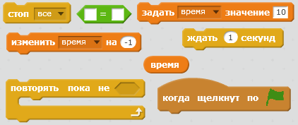
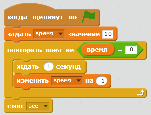
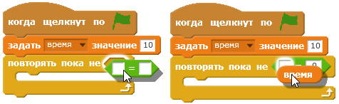

## Добавление таймера

\--- task \---

Создай новую переменную с именем 'время'.

\--- /task \---

\--- task \---

Можешь ли ты добавить на свою сцену таймер, чтобы дать игроку всего 10 секунд на то, чтобы поймать как можно больше призраков?

Твой таймер должен:

+ Иметь начальное значение в 10 секунд
+ Каждую секунду вести обратный отсчет

Игра должна прекратиться, когда таймер достигнет значения 0.

\--- hints \--- \--- hint \--- `когда шелкнут по зелёному флагу`{:class=”blockevents”} твоя переменная `время`{:class=”blockdata”} должна `измениться на 10`{:class=”blockdata”}. It should then `change by -1`{:class=”blockdata”} every second `until it reaches 0`{:class=”blockcontrol"}. \--- /hint \--- \--- hint \--- Here are the code blocks you will need to use:  \--- /hint \--- \--- hint \--- Here's how to add the timer to your game: 

And this is how to create the `time = 0` block:  \--- /hint \--- \--- /hints \---

\--- /task \---

\--- task \---

Ask a friend to test your game. How many points can they score?

\--- /task \---

If your game is too easy, you can:

+ Give the player less time
+ Make the ghosts appear less often
+ Make the ghosts smaller

\--- task \---

Change and test your game a few times until you're happy that it's the right level of difficulty.

\--- /task \---