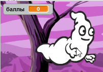

## Добавление счёта

Сейчас ты сделаешь свою игру более интересной, сохраняя счёт!

--- task ---

Создай новую переменную с именем `счёт`{:class="block3variables"}.

[[[generic-scratch3-add-variable]]]

--- /task ---

--- task ---

Можешь ли ты следить за счётом игрока? Игроки должны набирать баллы, щёлкая по приведениям, чтобы ловить их.

Каждый раз, когда игрок щёлкает по приведению, его количество баллов должно увеличиваться.



--- hints ---
 --- hint ---

`Когда зелёный флаг нажат`{:class="block3events"}, твоей переменной `счёт`{:class="block3variables"} должно быть `задано значение 0`{:class="block3variables"}. Сцена – лучшее место для добавления этого кода.

`Когда нажат спрайт привидения`{:class="block3events"}, переменная `счёт`{:class="block3variables"} должна `измениться на 1`{:class="block3variables"}.

--- /hint --- --- hint ---

Вот блоки кода, которые тебе понадобятся:


```blocks3
set [счёт v] to (0)

when flag clicked
```


```blocks3
change [счёт v] by (1)
```

--- /hint --- --- hint ---


```blocks3
when flag clicked
set [счёт v] to (0)
```


```blocks3
When this sprite clicked
hide
+ change [счёт v] by (1)
```

--- /hint ------ /hints ---

--- /task ---