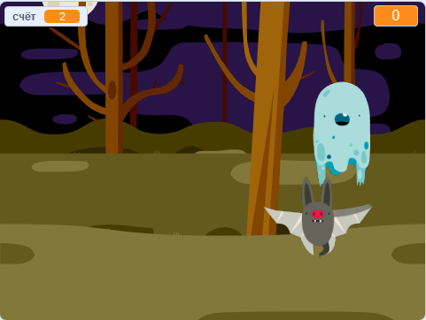

## Challenge

Improve your project with these challenges!

\--- task \---

Если твоя игра слишком проста, ты можешь:

+ Дать игроку меньше времени
+ Сделать так, чтобы приведения появлялись менее часто
+ Уменьшить размер приведений

\--- /task \---

\--- task \---

Можешь ли ты добавить в игру другие спрайты?

\--- collapse \---

* * *

title: Extra Sprites

* * *

Тебе нужно подумать о некоторых вещах для каждого спрайта, который ты хочешь добавить:

+ Насколько большим должен быть спрайт?
+ Должен ли он появляться более или менее часто, чем спрайт-приведение?
+ Как он будет выглядеть и какой звук он издаст, когда будет пойман?
+ Сколько баллов получит (или потеряет) игрок за его поимку?

Если тебе понадобится помощь, ты можешь вернуться к инструкциям на предыдущих этапах или спросить друга!

\--- /collapse \---

\--- /task \---

\--- task \---

Can you add code to your ghost sprite to make the ghost `wait`{:class="block3control"} a random amount of time while it is hidden?

\--- /task \---

\--- task \---

Can you use the `set size`{:class="block3looks"} block to make your ghost a randomly larger or smaller each time it appears?

\--- /task \---

\--- task \---

Can you add code to your ghost so that the ghost makes a sound when it's caught?

\--- /task \---