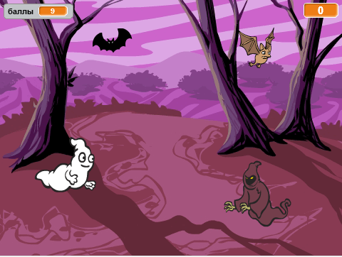

## Задача: больше спрайтов

Можешь ли ты добавить в игру другие спрайты?

Тебе нужно подумать о некоторых вещах для каждого спрайта, который ты хочешь добавить:

+ Насколько большим должен быть спрайт?
+ Должен ли он появляться более или менее часто, чем спрайт-приведение?
+ Как он будет выглядеть и какой звук он издаст, когда будет пойман?
+ Сколько баллов получит (или потеряет) игрок за его поимку?

Если тебе понадобится помощь, ты можешь вернуться к инструкциям на предыдущих этапах или спросить друга!