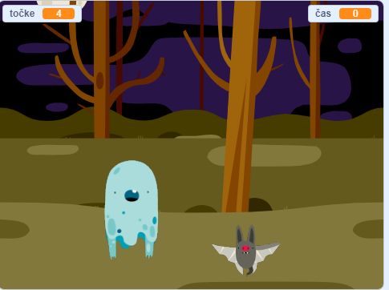

--- no-print ---

To je različica projekta **Scratch 3**. Obstaja tudi različica projekta [Scratch 2](https://projects.raspberrypi.org/en/projects/ghostbusters-scratch2).

--- /no-print ---

## Uvod

Ustvaril boš igro, v kateri boš lovil duhove!

--- no-print ---

  <iframe allowtransparency="true" width="485" height="402" src="https://scratch.mit.edu/projects/embed/368928675/?autostart=false" frameborder="0" scrolling="no"></iframe>
  

--- /no-print ---

--- print-only ---

--- /print-only ---

--- collapse ---
---
title: Kaj potrebuješ?
---
### Strojna oprema

- Računalnik

### Programska oprema

- Scratch 3 ( [spletu](https://rpf.io/scratchon){:target="_blank"} ali [brez povezave](https://rpf.io/scratchoff){:target="_blank"})

--- /collapse ---

--- collapse ---
---
title: Kaj se boš naučil-a?
---
- Razumevanja potrebe po pavzah med dejanji znotraj zank
- Rabe kode za ustvarjanje naključnih števil v Scratchu
- Dodajanja spremenljivk za shranjevanje števila točk v Scratchu

--- /collapse ---

--- collapse ---
---
title: Dodatne informacije za izobraževalce
---
--- no-print ---

Če želite natisniti ta projekt, uporabite [tiskalniku prijazno različico](https://projects.raspberrypi.org/sl-SI/projects/ghostbusters/print){:target="_blank"}.

--- /no-print ---

Zaključen projekt lahko najdete [tukaj](https://rpf.io/p/sl-SI/ghostbusters-get).

--- /collapse ---