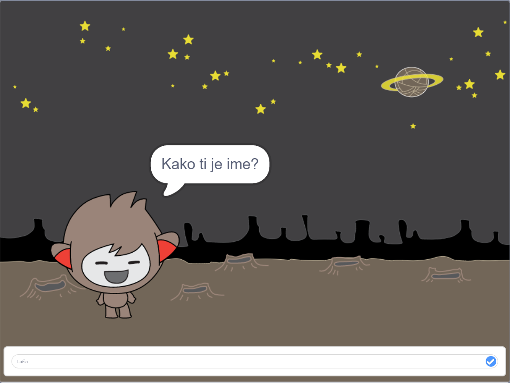

## Kaj sledi?

Čestitamo za uspešno zaključen projekt Lovci duhov! Ali bi rad-a ustvaril še kaj malo bolj zahtevnega?

Preizkusi projekt [Čvekobot](https://projects.raspberrypi.org/sl-SI/projects/chatbot?utm_source=pathway&utm_medium=whatnext&utm_campaign=projects).

--- no-print ---

Klikni na zeleno zastavico in nato klikini na lik Čvekobota, da začneš pogovor. Ko te bo Čvekobot nekaj vprašal, vtipkaj svoj odgovor v polje na dnu odra in nato klikni na modri znak na desni (ali pritisni tipko `enter`), da se bo pojavil Čvekobotov odgovor.

  <iframe allowtransparency="true" width="485" height="402" src="https://scratch.mit.edu/projects/embed/368951448/?autostart=false" 
  frameborder="0" scrolling="no"></iframe>

--- /no-print ---

--- print-only ---

--- /print-only ---

***

Ta projekt so prevedli prostovoljci:

Arnold Marko

Zahvaljujoč prostovoljcem, lahko ljudem po vsem svetu omogočimo, da se učijo v svojem jeziku. S prostovoljnim prevajanjem nam lahko pomagate, da dosežemo več ljudi - več informacij na [rpf.io/translate](https://rpf.io/translate).