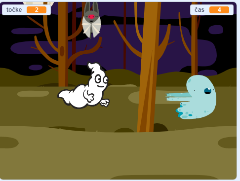

## Challenge

Improve your project with these challenges!

\--- task \---

Če je tvoja igra preveč enostavna, lahko:

+ Daš igralcu manj časa
+ Narediš, da se duhovi pojavljajo manj pogosto
+ Zmanjšaš figure duhcev

\--- /task \---

\--- task \---

Ali lahko igri dodaš druge figure?

\--- collapse \---

* * *

title: Extra Sprites

* * *

Za vsako figuro, ki jo želiš dodati, moraš razmisliti o tem:

+ Kako velika naj bo?
+ Ali naj se pojavi bolj ali manj pogosto kot figura duhca?
+ Kako izgleda/zveni, ko jo ujamejo?
+ Koliko točk igralec dobi (ali izgubi), ko ulovi figuro?

Če potrebuješ pomoč, se lahko vrneš na prejšnje korake ali vprašaj prijatelja!

\--- /collapse \---

\--- /task \---

\--- task \---

Can you add code to your ghost sprite to make the ghost `wait`{:class="block3control"} a random amount of time while it is hidden?

\--- /task \---

\--- task \---

Can you use the `set size`{:class="block3looks"} block to make your ghost a randomly larger or smaller each time it appears?

\--- /task \---

\--- task \---

Can you add code to your ghost so that the ghost makes a sound when it's caught?

\--- /task \---