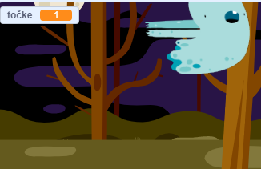

## Dodaj točkovanje

Svojo igro boš naredil-a bolj zanimivo s štetjem točk!

--- task ---

Ustvari novo spremenljivko z imenom `točke`{:class="block3variables"}.

[[[generic-scratch3-add-variable]]]

--- /task ---

--- task ---

Ali lahko spremljaš igralčev rezultat? Igralci bi morali osvojiti točke, kadar kliknejo na duhca in ga ujamejo.

Vsakič, ko igralec klikne na duhca, se njegovo število točk poveča.



--- hints --- --- hint ---

`Ko kliknemo na zastavico`{:class="block3events"}, se mora spremenljivka `točke`{:class="block3variables"} `nastaviti na 0`{:class="block3variables"}. Najbolj primerno mesto za dodajanje te kode je oder.

`Ko kliknemo to figuro`{:class="block3events"} se mora spremenljivka `točke`{:class="block3variables"} temu ustrezno `spremeniti za 1`{:class="block3variables"}.

--- /hint --- --- hint ---

To so bloki kode, ki jih potrebuješ:


```blocks3
nastavi [točke v] na (0)

ko je kliknjena zelena zastavica
```


```blocks3
spremeni [točke v] za (1)
```

--- /hint --- --- hint ---


```blocks3
ko je kliknjena zelena zastavica
nastavi [točke v] na (0)
```


```blocks3
ko kliknemo to figuro
skrij
+ spremeni [točke v] za (1)
```

--- /hint --- --- /hints ---

--- /task ---